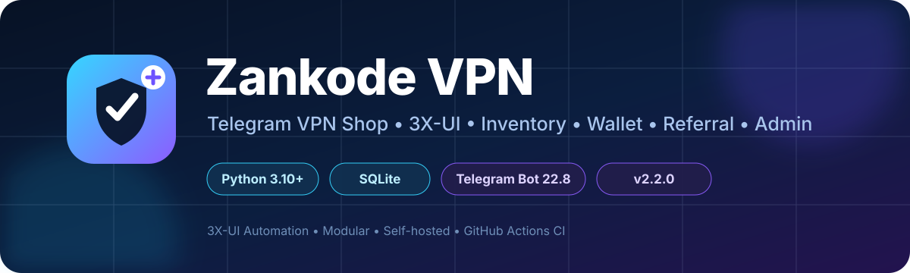

<p align="center">
  
</p>

<h1 align="center">Zankode VPN</h1>

<p align="center">
  <strong>Telegram VPN Store & 3X-UI Manager</strong><br>
  A complete Telegram-based system for selling, delivering and managing VPN services.
</p>

<p align="center">
  <strong>v2.2.1</strong><br>
  <a href="#فارسی">فارسی</a> &nbsp;•&nbsp; <a href="#english">English</a>
</p>

---

<a id="فارسی"></a>

# معرفی Zankode VPN

**Zankode VPN** یک ربات کامل و ماژولار برای فروش و مدیریت سرویس‌های VPN داخل تلگرام است.

تمام فرآیند خرید و مدیریت سرویس، از انتخاب پلن و پرداخت تا تحویل، مشاهده وضعیت، تمدید، کیف پول، هدیه، Referral و پشتیبانی داخل خود تلگرام انجام می‌شود. ادمین نیز یک پنل مدیریتی کامل داخل ربات دارد و کاربران، سفارش‌ها، سرویس‌ها، موجودی، پرداخت‌ها و عملیات روزانه فروشگاه را مدیریت می‌کند.

---

<h2>
  
  پنل کاربران
</h2>

- ثبت خودکار کاربر
- مشاهده و خرید پلن‌های فعال
- ارسال فیش پرداخت
- پرداخت با کیف پول
- شارژ کیف پول
- استفاده از کد تخفیف
- دریافت سرویس پس از تأیید سفارش
- مشاهده سرویس‌های خریداری‌شده
- مشاهده تاریخ خرید، فعال‌سازی و انقضا
- مشاهده حجم مصرف‌شده و باقی‌مانده در سرویس‌های 3X-UI
- مشاهده IP Limit و وضعیت سرویس
- تمدید سرویس
- دریافت مجدد اطلاعات اتصال
- خرید سرویس برای دیگران
- دریافت و فعال‌سازی Gift Code
- دریافت اکانت تست
- دعوت دوستان و دریافت پاداش Referral
- مشاهده سطح و پیشرفت حساب
- ثبت و پیگیری تیکت پشتیبانی

---

<h2>
  
  پنل ادمین
</h2>

- داشبورد آماری فروش و عملیات
- مدیریت و جستجوی کاربران
- مشاهده سفارش‌ها و وضعیت پرداخت
- مشاهده خریدار و پلن هر سفارش
- مشاهده تاریخچه کامل خرید هر کاربر
- تأیید یا رد پرداخت‌ها
- مدیریت پلن‌ها
- مدیریت موجودی سرویس‌ها
- مدیریت کیف پول و درخواست‌های شارژ
- مدیریت کدهای تخفیف
- مدیریت Gift Code و اکانت‌های تست
- مدیریت تیکت‌های پشتیبانی
- ارسال پیام همگانی و هدفمند
- گزارش فروش و خروجی اطلاعات مدیریتی
- تهیه Backup
- مدیریت تنظیمات فروشگاه
- مدیریت Clientهای 3X-UI از داخل تلگرام

---

<h2>
  
  3X-UI Integration
</h2>

برای هر پلن می‌توان روش تحویل را روی **Inventory** یا **3X-UI** قرار داد.

### Inventory

کانفیگ‌های از قبل آماده‌شده در موجودی قرار می‌گیرند و هنگام خرید به‌صورت کنترل‌شده به کاربر تحویل داده می‌شوند.

### 3X-UI

Zankode می‌تواند Client را مستقیماً روی 3X-UI ایجاد و مدیریت کند.

- ساخت خودکار Client
- انتخاب یک یا چند Inbound
- تعیین حجم سرویس
- تعیین مدت و تاریخ انقضا
- تعیین IP Limit
- دریافت اطلاعات اتصال
- مشاهده وضعیت و Traffic
- مشاهده حجم باقی‌مانده
- تمدید همان Client
- Reset Traffic هنگام تمدید
- Sync وضعیت Client
- حذف Client
- بررسی وضعیت اتصال پنل
- بازیابی امن عملیات نیمه‌کاره و جلوگیری از ساخت Client تکراری در Retryها

اعتبار سرویس از زمان **تحویل/فعال‌سازی واقعی** شروع می‌شود، نه از لحظه ایجاد سفارش.

---

<h2>
  
  Wallet System
</h2>

هر کاربر یک کیف پول مستقل دارد و می‌تواند هزینه سفارش‌ها را از موجودی حساب خود پرداخت کند.

- پرداخت سفارش با Wallet
- درخواست شارژ کیف پول
- تأیید شارژ توسط ادمین
- ثبت تراکنش‌ها
- دریافت پاداش‌ها
- دریافت کمیسیون Referral

---

<h2>
  
  Referral System
</h2>

هر کاربر لینک دعوت اختصاصی دارد و می‌تواند با دعوت کاربران جدید پاداش دریافت کند.

- لینک دعوت اختصاصی
- ثبت Referrer و کاربران دعوت‌شده
- محاسبه و پرداخت کمیسیون
- واریز پاداش به کیف پول
- سیستم وفاداری و سطح‌بندی مشتریان

---

<h2>
  
  Gift System
</h2>

کاربران می‌توانند سرویس را به‌عنوان هدیه خریداری کنند و آن را با Gift Code به شخص دیگری منتقل کنند.

- ایجاد Gift Code
- فعال‌سازی هدیه توسط دریافت‌کننده
- انتقال مالکیت سرویس به دریافت‌کننده
- شروع اعتبار هدیه هنگام Redeem
- پشتیبانی از Gift در Inventory و 3X-UI
- بازیابی عملیات نیمه‌کاره و جلوگیری از استفاده دوباره از یک هدیه

---

<h2>
  
  Automation
</h2>

بخش زیادی از عملیات روزانه Zankode به‌صورت خودکار انجام می‌شود.

- بررسی و هشدار کمبود موجودی
- بررسی موجودی اکانت تست
- اعلان نزدیک‌شدن به تاریخ انقضا
- اعلان سرویس‌های منقضی‌شده
- کنترل سفارش‌های پرداخت‌نشده قدیمی
- گزارش‌های دوره‌ای
- بازیابی عملیات نیمه‌کاره بعد از Restart
- Retry کنترل‌شده برای تحویل‌های ناموفق
- اجرای Broadcast بدون متوقف‌کردن پنل ادمین

---

<h2>
  
  Smart Order & Customer Management
</h2>

Zankode ارتباط دقیق بین کاربر، سفارش، پلن و سرویس تحویل‌شده را نگه می‌دارد؛ بنابراین ادمین می‌تواند به‌وضوح ببیند **هر کاربر چه چیزی، چه زمانی و با کدام سفارش خریداری کرده است**.

```text
User
  ↓
Orders
  ↓
Purchased Plan
  ↓
VPN Service
```

تمدیدهای 3X-UI به همان سرویس اصلی متصل می‌مانند تا آمار سرویس فعال، انقضا و مصرف دوباره‌شماری نشود.

---

## Telegram Premium Emoji

Zankode از **Telegram Premium Custom Emoji** برای بخش‌های پشتیبانی‌شده رابط کاربری استفاده می‌کند. در صورت فعال بودن Premium Emoji، آیکون‌های تنظیم‌شده در منوها و دکمه‌های ربات نمایش داده می‌شوند و ظاهر پنل یکپارچه‌تر و حرفه‌ای‌تر می‌شود.

---

<a id="english"></a>

# English

**Zankode VPN** is a modular Telegram-based system for selling, delivering and managing VPN services.

Users can complete the full purchase and service-management flow inside Telegram, while administrators manage customers, orders, plans, payments, inventory and VPN clients through a dedicated in-bot admin panel.

---

<h2>
  
  User Panel
</h2>

Users can browse plans, purchase services, upload payment receipts, pay with wallet balance, apply coupons, view purchased services, check live usage and expiry, request renewals, redeem gifts, request test accounts, invite friends and contact support.

---

<h2>
  
  Admin Panel
</h2>

Administrators can manage users, orders, payment approvals, purchase history, plans, inventory, wallets, coupons, gifts, test accounts, support tickets, broadcasts, sales reports, backups and 3X-UI clients directly from Telegram.

---

<h2>
  
  3X-UI Management
</h2>

Zankode supports direct 3X-UI client management, including:

- Automatic client creation
- Multi-inbound assignment
- Traffic quota, expiry and IP limits
- Live status and traffic usage
- Client renewal and traffic reset
- Client synchronization and deletion
- Connection health checks
- Safe retry/recovery without duplicate client creation

Service validity starts when the service is actually **activated/delivered**, not when the order is created.

---

<h2>
  
  Wallet
</h2>

Each user has an independent wallet for purchases, top-ups, referral commissions and store rewards.

---

<h2>
  
  Referral
</h2>

Users receive personal referral links and can earn wallet rewards by inviting new customers.

---

<h2>
  
  Gift Codes
</h2>

VPN services can be purchased as gifts and transferred to another user with a unique Gift Code. Gift validity starts when the recipient redeems the service.

---

<h2>
  
  Automated Operations
</h2>

Zankode automatically handles stock monitoring, expiry notifications, service reminders, old-order handling, periodic reports, interrupted-operation recovery and controlled delivery retries.

---

<h2>
  
  Customer & Order Tracking
</h2>

Every customer is connected to their orders, purchased plans and delivered services, giving administrators a clear history of **who purchased what** while keeping 3X-UI renewals linked to one canonical service.

---

## Telegram Premium Emoji

Zankode supports **Telegram Premium Custom Emoji** for supported menu items and interface elements, providing a more polished in-bot experience when configured.

---

<p align="center">
  <strong>Zankode VPN</strong><br>
  Telegram VPN Store & 3X-UI Manager
</p>

<p align="center">
  If you find this project useful, consider giving it a ⭐ on GitHub.
</p>
